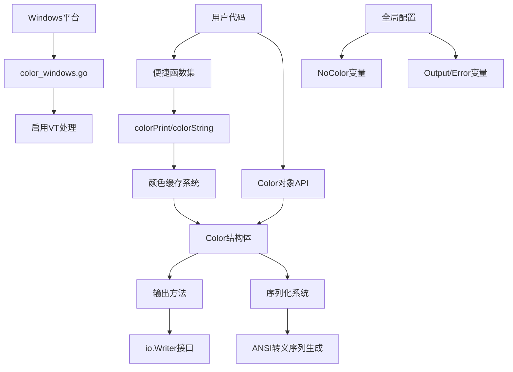

# color 项目分析报告

> 项目路径：`d:\峡谷\Dev\本地项目\color`  
> 分析日期：2026-05-03  
> 分析工具：Trae IDE + Kimi-K2.5

---

## 一、目录结构梳理

### 1.1 项目根目录结构

```
d:\峡谷\Dev\本地项目\color/
├── .gitignore          # Git忽略文件配置
├── LICENSE             # MIT许可证文件
├── go.mod              # Go模块定义文件
├── go.sum              # Go模块依赖校验文件
├── doc.go              # 包文档说明文件
├── color.go            # 核心功能实现文件（主代码）
├── color_test.go       # 单元测试文件
└── color_windows.go    # Windows平台特定实现文件
```

### 1.2 目录/文件规范评估

| 项目 | 评估结果 | 说明 |
|------|----------|------|
| 目录层级 | ✅ 规范 | 扁平化结构，符合Go单包库的设计习惯 |
| 文件命名 | ✅ 规范 | 遵循Go命名规范：`包名_平台.go`、`包名_test.go` |
| 代码组织 | ✅ 规范 | 按功能分离：核心逻辑、平台适配、测试、文档 |
| 文档完整性 | ✅ 完善 | doc.go包含详细的使用示例和API说明 |

**评价**：这是一个结构简洁、规范的Go语言工具库项目，采用扁平化目录结构，符合Go语言标准库的设计风格。

---

## 二、核心功能模块识别

### 2.1 模块总览

| 模块名称 | 核心功能 | 对应代码文件 | 模块类型 |
|----------|----------|--------------|----------|
| ANSI颜色输出 | 提供终端彩色文本输出能力 | color.go | 业务核心模块 |
| Windows平台适配 | Windows控制台ANSI支持启用 | color_windows.go | 平台适配模块 |
| 颜色对象管理 | Color结构体的创建、配置、缓存 | color.go | 基础支撑模块 |
| 便捷函数集 | 预定义颜色的快速调用函数 | color.go | 业务核心模块 |
| 单元测试 | 功能验证和回归测试 | color_test.go | 测试模块 |

### 2.2 核心功能详细说明

#### 2.2.1 ANSI颜色输出模块

**核心功能**：通过ANSI转义序列为终端文本添加颜色和样式

**核心输入**：
- 文本内容（string/interface{}）
- 颜色属性（Attribute常量：前景色、背景色、高亮色等）
- 样式属性（Bold、Underline、Italic等）
- RGB值（24位真彩色）

**核心输出**：
- 带ANSI转义序列的格式化字符串
- 直接输出到io.Writer或标准输出

**关键代码位置**：
```go
// color.go:L49-L52 - Color结构体定义
type Color struct {
    params  []Attribute  // SGR参数列表
    noColor *bool        // 是否禁用颜色（局部覆盖）
}

// color.go:L88-L137 - 颜色常量定义
const (
    FgBlack Attribute = iota + 30  // 前景色起始
    FgRed
    FgGreen
    // ... 更多颜色常量
)
```

#### 2.2.2 Windows平台适配模块

**核心功能**：在Windows系统上启用虚拟终端处理，支持ANSI颜色

**核心依赖**：`golang.org/x/sys/windows`

**关键代码位置**：
```go
// color_windows.go:L8-L20
func init() {
    if os.Stdout == nil {
        return
    }
    var outMode uint32
    out := windows.Handle(os.Stdout.Fd())
    if err := windows.GetConsoleMode(out, &outMode); err != nil {
        return
    }
    outMode |= windows.ENABLE_PROCESSED_OUTPUT | windows.ENABLE_VIRTUAL_TERMINAL_PROCESSING
    _ = windows.SetConsoleMode(out, outMode)
}
```

#### 2.2.3 便捷函数集

**核心功能**：提供预定义颜色的快速调用，无需创建Color对象

**函数分类**：

| 类别 | 函数示例 | 功能 |
|------|----------|------|
| 打印函数 | `Red()`, `Green()`, `Blue()` | 直接打印带颜色文本（自动换行） |
| 字符串函数 | `RedString()`, `GreenString()` | 返回带颜色格式的字符串 |
| 高亮打印 | `HiRed()`, `HiGreen()` | 高亮颜色打印 |
| 高亮字符串 | `HiRedString()`, `HiGreenString()` | 高亮颜色字符串 |

**关键代码位置**：`color.go:L576-L733`

---

## 三、模块间依赖关系分析

### 3.1 依赖关系图（Mermaid）



### 3.2 依赖关系说明

| 依赖方向 | 依赖类型 | 说明 |
|----------|----------|------|
| 便捷函数 → Color对象 | 组合 | 便捷函数内部通过`getCachedColor`获取或创建Color对象 |
| Color对象 → io.Writer | 接口依赖 | 所有输出方法依赖io.Writer接口 |
| color_windows.go → color.go | 隐式依赖 | init函数自动执行，无需显式调用 |
| 全局变量 → Color对象 | 状态依赖 | NoColor变量影响所有Color实例的默认行为 |

### 3.3 潜在问题识别

| 问题类型 | 位置 | 描述 | 风险等级 |
|----------|------|------|----------|
| 全局状态 | color.go:L24-L37 | NoColor等全局变量可被任意修改 | 中 |
| 缓存未清理 | color.go:L482-L491 | colorsCache只增不减，长期运行可能占用内存 | 低 |
| Windows init忽略错误 | color_windows.go | SetConsoleMode错误被静默忽略 | 低 |

---

## 四、设计模式与实现逻辑

### 4.1 设计模式识别

#### 4.1.1 建造者模式（Builder Pattern）

**应用场景**：Color对象的链式创建和属性添加

**代码位置**：`color.go:L168-L206`

```go
// 链式调用示例
c := color.New(color.FgCyan).Add(color.Underline)
d := color.New(color.FgCyan, color.Bold)
red := color.New(color.FgRed)
boldRed := red.Add(color.Bold)
whiteBackground := red.Add(color.BgWhite)
```

**模式优势**：
- 支持灵活的属性组合
- 代码可读性强
- 易于扩展新的属性类型

#### 4.1.2 工厂模式（Factory Pattern）

**应用场景**：便捷函数作为Color对象的工厂方法

**代码位置**：`color.go:L576-L733`

```go
// 工厂函数示例
func Red(format string, a ...interface{}) { 
    colorPrint(format, FgRed, a...) 
}

func colorPrint(format string, p Attribute, a ...interface{}) {
    c := getCachedColor(p)
    // ... 使用缓存的Color对象
}
```

#### 4.1.3 单例模式（缓存变体）

**应用场景**：颜色对象缓存，避免重复创建相同属性的Color对象

**代码位置**：`color.go:L482-L491`

```go
var (
    colorsCache   = make(map[Attribute]*Color)
    colorsCacheMu sync.Mutex
)

func getCachedColor(p Attribute) *Color {
    colorsCacheMu.Lock()
    defer colorsCacheMu.Unlock()
    c, ok := colorsCache[p]
    if !ok {
        c = New(p)
        colorsCache[p] = c
    }
    return c
}
```

### 4.2 核心业务逻辑流程

#### 4.2.1 文本着色输出流程

```
用户调用 (如: color.Red("text"))
    ↓
便捷函数 colorPrint()
    ↓
获取/创建 Color 对象 (getCachedColor)
    ↓
调用 Color.Print()
    ↓
设置颜色 (c.Set()) → 输出 ANSI 序列
    ↓
输出文本内容 (fmt.Fprint)
    ↓
重置颜色 (c.unset()) → 输出 Reset 序列
```

**代码实现**：`color.go:L253-L275`

```go
func (c *Color) Print(a ...interface{}) (n int, err error) {
    c.Set()              // 设置颜色
    defer c.unset()      // 延迟重置
    return fmt.Fprint(Output, a...)
}
```

#### 4.2.2 ANSI序列生成逻辑

```
Color.params [FgRed, Bold]
    ↓
sequence() 方法
    ↓
转换为字符串: ["31", "1"]
    ↓
Join: "31;1"
    ↓
format(): "\x1b[31;1m"
```

**代码实现**：`color.go:L402-L418`

```go
func (c *Color) sequence() string {
    format := make([]string, len(c.params))
    for i, v := range c.params {
        format[i] = strconv.Itoa(int(v))
    }
    return strings.Join(format, ";")
}

func (c *Color) format() string {
    return fmt.Sprintf("%s[%sm", escape, c.sequence())
}
```

### 4.3 代码质量评估

| 评估项 | 结果 | 说明 |
|--------|------|------|
| 逻辑清晰度 | ✅ 优秀 | 职责分离明确，函数单一职责 |
| 代码冗余度 | ✅ 低 | 通过函数生成器减少重复代码 |
| 硬编码问题 | ✅ 无 | 颜色值使用常量定义 |
| 注释完整性 | ✅ 完善 | 所有导出函数都有文档注释 |

---

## 五、技术栈评估

### 5.1 核心技术栈

| 技术组件 | 版本 | 用途 | 社区状态 |
|----------|------|------|----------|
| Go语言 | 1.25.0 | 开发语言 | ✅ 活跃，官方维护 |
| go-colorable | v0.1.14 | Windows颜色输出支持 | ✅ 活跃维护 |
| go-isatty | v0.0.22 | 终端检测 | ✅ 活跃维护 |
| golang.org/x/sys | v0.43.0 | 系统调用（Windows） | ✅ 官方扩展库 |

### 5.2 技术栈适配性分析

| 评估维度 | 评价 |
|----------|------|
| 场景适配 | ✅ 优秀 - 轻量级工具库，依赖精简 |
| 复杂度匹配 | ✅ 合理 - 小型库使用标准库+少量依赖 |
| 跨平台支持 | ✅ 完善 - 原生支持Windows/Unix |
| 版本兼容性 | ✅ 良好 - 使用Go 1.25新特性，依赖版本较新 |

### 5.3 潜在技术风险

| 风险项 | 描述 | 建议 |
|--------|------|------|
| Go版本要求 | 要求Go 1.25.0，较新版本 | 如需兼容旧版本，可降低go.mod要求 |
| Windows依赖 | 依赖golang.org/x/sys | 该库稳定，风险低 |

---

## 六、补充分析项

### 6.1 代码规范

| 规范项 | 评估结果 | 说明 |
|--------|----------|------|
| 命名规范 | ✅ 规范 | 遵循Go命名约定：导出函数大写，私有函数小写 |
| 注释规范 | ✅ 完善 | 包注释、函数注释完整，包含使用示例 |
| 代码风格 | ✅ 一致 | 使用标准Go代码风格，格式化良好 |
| 错误处理 | ✅ 规范 | 错误返回值处理符合Go惯例 |

### 6.2 异常处理

| 处理场景 | 实现方式 | 评估 |
|----------|----------|------|
| nil stdout/stderr | 返回io.Discard | ✅ 健壮 |
| Windows控制台模式设置 | 静默忽略错误 | ⚠️ 可接受，非关键路径 |
| 并发访问缓存 | 使用sync.Mutex | ✅ 线程安全 |

### 6.3 扩展性评估

| 扩展点 | 评估 | 说明 |
|--------|------|------|
| 新增颜色属性 | ✅ 容易 | 添加新的Attribute常量即可 |
| 新增输出目标 | ✅ 容易 | 实现io.Writer接口即可 |
| 自定义颜色格式 | ✅ 支持 | 支持RGB和256色 |
| 插件机制 | ⚠️ 不支持 | 小型库无需复杂插件机制 |

### 6.4 性能关键点

| 代码位置 | 潜在问题 | 优化建议 |
|----------|----------|----------|
| colorsCache | 无过期机制 | 当前设计合理，缓存对象数量固定 |
| sequence() | 每次分配slice | 可考虑sync.Pool优化高频调用 |
| wrap() | 字符串拼接 | 使用strings.Builder可能更高效 |

---

## 七、总结

### 7.1 项目核心特点

1. **轻量高效**：代码精简（约733行），依赖少（3个外部包）
2. **API友好**：提供便捷函数和链式调用两种使用方式
3. **跨平台**：原生支持Windows和Unix-like系统
4. **标准兼容**：遵循NO_COLOR环境变量等行业标准
5. **线程安全**：颜色缓存使用互斥锁保护

### 7.2 待优化点

| 优先级 | 优化项 | 建议 |
|--------|--------|------|
| 低 | 缓存清理 | 当前设计无需清理，但可考虑LRU |
| 低 | 性能优化 | 高频场景可使用strings.Builder |
| 低 | 错误处理 | Windows init可添加日志记录 |

### 7.3 关键记忆点

- **项目定位**：Go语言ANSI颜色输出库，用于终端文本着色
- **核心结构**：`Color`结构体包含`params []Attribute`和`noColor *bool`
- **使用方式**：
  - 便捷函数：`color.Red("text")`
  - 链式API：`color.New(color.FgRed).Add(color.Bold).Print("text")`
- **平台适配**：Windows通过`color_windows.go`的`init()`启用VT处理
- **颜色禁用**：支持全局`NoColor`变量和`NO_COLOR`环境变量
- **缓存机制**：使用`map[Attribute]*Color`缓存单属性Color对象

---

## 八、附录

### 8.1 文件统计

| 文件 | 代码行数 | 说明 |
|------|----------|------|
| color.go | ~733行 | 核心实现 |
| color_test.go | ~664行 | 单元测试 |
| color_windows.go | ~22行 | Windows适配 |
| doc.go | ~134行 | 包文档 |

### 8.2 许可证

MIT License - 允许自由使用、修改和分发

---

> **报告状态**：已完成项目记忆建立，后续可基于此回答项目相关问题。
